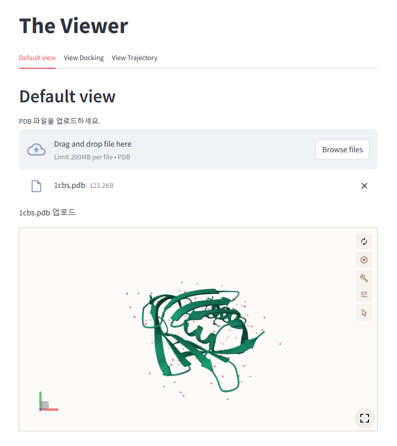
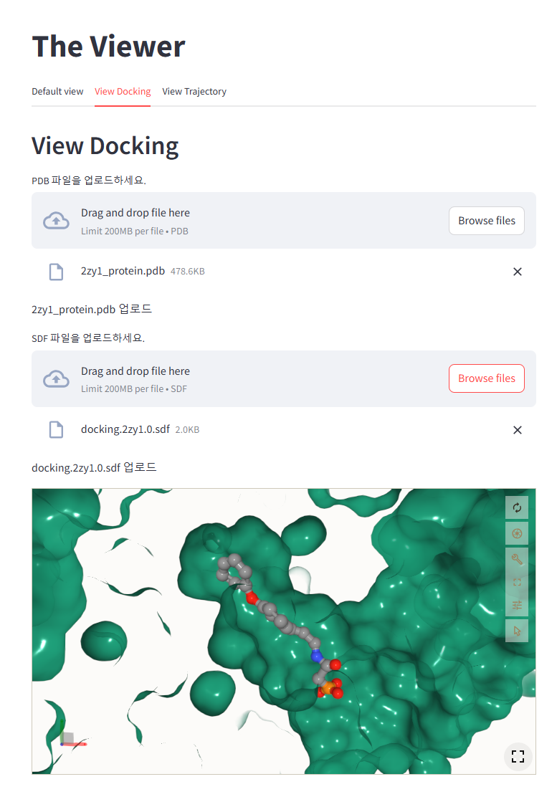
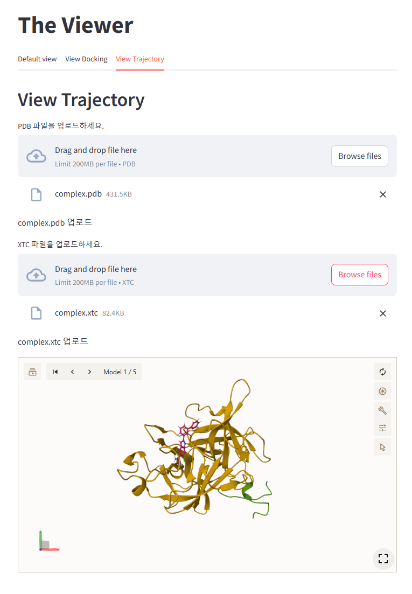

# Example: Viewer using streamlit-molstar

## Install

`conda env create -f environment.yml`
`pip install streamlit-molstar`

## Activate Conda

`conda activate the_viewer_env`

## Usage

`streamlit run v3.py`

## Web pages

